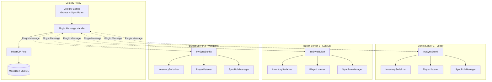
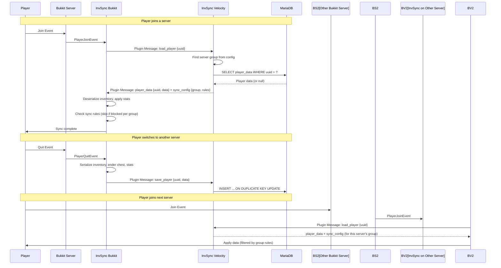

# InvSync Architecture

## System Overview

## Data Flow

## Sync Rules Per Group

| Group | Inventory | Ender Chest | Health | Food | XP |
|-------|:---------:|:-----------:|:-----:|:----:|:--:|
| **lobby** | ✅ | ✅ | ✅ | ✅ | ❌ |
| **survival** | ✅ | ❌ | ✅ | ✅ | ✅ |
| **minigame** | ❌ | ❌ | ❌ | ❌ | ❌ |
| **creative** | ✅ | ✅ | ❌ | ❌ | ✅ |

## Message Protocol

**Channel**: `invsync:main` (namespaced)

### Bukkit → Velocity
| Type | Payload | Trigger |
|------|---------|---------|
| `load_player` | `{"uuid":"..."}` | PlayerJoinEvent |
| `save_player` | `{"uuid":"...","player_name":"...","data":{...}}` | Quit/Kick/Death |

### Velocity → Bukkit
| Type | Payload | Trigger |
|------|---------|---------|
| `player_data` | `{"uuid":"...","data":{...}}` | Response to load_player |
| `player_data_not_found` | `{"uuid":"..."}` | No data in DB |
| `sync_config` | `{"server_group":"...","sync":{...}}` | On first contact + each load |

## Security

- **No DB credentials on Bukkit servers** — all database access via Velocity
- **Prepared Statements** on Velocity for all SQL queries
- **Plugin messaging scoped** — only servers in the Velocity network can participate
- **UUID-based lookup** — prevents data leaks between players
